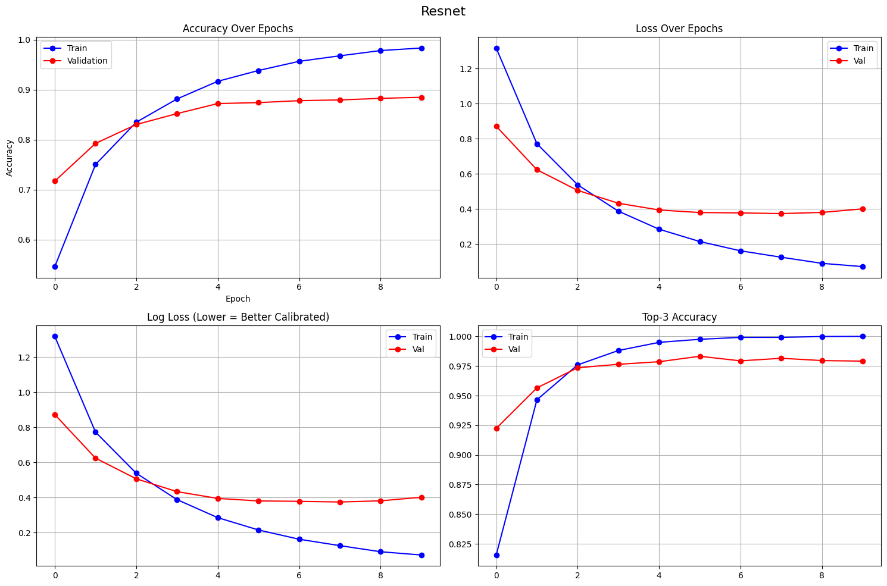
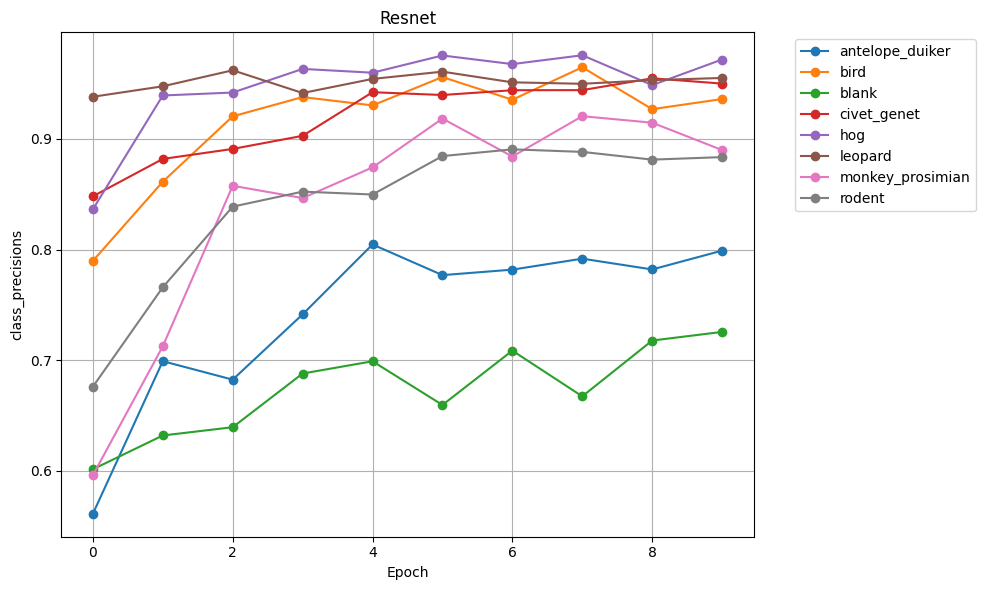
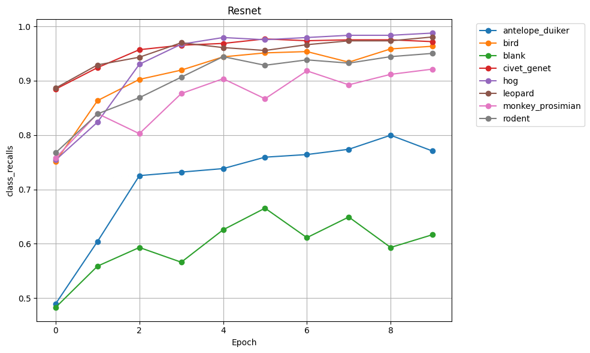

# DSS Animal Classification - ML Pipeline Architecture

## Basic resnet18 Model

### Model Configuration

**Model Name**: basic_resnet18_model.pth

**Architecture**: resnet18 with IMAGENET1K_V1 pretrained weights

**Number of Classes**: 8 (antelope_duiker, bird, blank, civet_genet, hog, leopard, monkey_prosimian, rodent)

### Training Hyperparameters

- **Epochs**: 5
- **Batch Size**: 64
- **Learning Rate**: 0.001
- **Image Size**: 224x224
- **CUDA**: True
- **Criterion**: nn.CrossEntropyLoss()
- **Optimizer**: optim.AdamW(model.parameters(), lr=args.learning_rate)
- **Learning Rate Scheduler**: None
- **Mixup**: Disabled
- **Train/Val Split**: 75% train / 25% validation

### Data Augmentation

**Train Transforms**:

```python
train_transform = transforms.Compose(
    [
        transforms.Resize((img_size, img_size)),
        transforms.ToTensor(),
        transforms.Normalize(mean=[0.485, 0.456, 0.406], std=[0.229, 0.224, 0.225]),
    ]
)
```

**Validation Transforms**:

```python
val_transform = transforms.Compose(
    [
        transforms.Resize((img_size, img_size)),
        transforms.ToTensor(),
        transforms.Normalize(mean=[0.485, 0.456, 0.406], std=[0.229, 0.224, 0.225]),
    ]
)
```

### Model Architecture Details

- **Base Model**: ResNet18 from torchvision.models
- **Pretrained Weights**: IMAGENET1K_V1
- **Final Layer**: Modified FC layer (num_features → 8 classes)
- **Input Shape**: (3, 224, 224)

### Training Details

- **Device**: CUDA (if available)
- **Data Loading**: AnimalDataset (custom PyTorch Dataset)
- **Best Model Selection**: Based on validation accuracy
- **Model Saving**:
  - Final model: basic_resnet18_model.pth
  - Best model: sagemaker_best_resnet18_model.pth

### Results

**Final Epoch Metrics**:
[METRICS] epoch=4 train_loss=0.2881 train_acc=0.90 val_loss=0.4536 val_acc=0.86

**Best Validation Accuracy**: 0.86


Train                                               

| Epoch |    Acc |   Loss | LogLoss | Top-3 Acc | 
| ----: | -----: | -----: | ------: | --------: |
|     0 | 0.5459 | 1.3178 |  1.3178 |    0.8155 |
|     1 | 0.7504 | 0.7724 |  0.7724 |    0.9465 |
|     2 | 0.8350 | 0.5382 |  0.5382 |    0.9760 |
|     3 | 0.8816 | 0.3880 |  0.3880 |    0.9881 |
|     4 | 0.9169 | 0.2852 |  0.2852 |    0.9950 |
|     5 | 0.9386 | 0.2150 |  0.2150 |    0.9976 |
|     6 | 0.9570 | 0.1621 |  0.1621 |    0.9992 |
|     7 | 0.9681 | 0.1256 |  0.1256 |    0.9992 |
|     8 | 0.9786 | 0.0908 |  0.0908 |    0.9999 |
|     9 | 0.9837 | 0.0722 |  0.0722 |    1.0000 |


Val
| Epoch |    Acc |   Loss | LogLoss | Top-3 Acc |
| ----: | -----: | -----: | ------: | --------: |
|     0 | 0.7171 | 0.8724 |  0.8724 |    0.8155 |
|     1 | 0.7926 | 0.6241 |  0.6241 |    0.9465 |
|     2 | 0.8304 | 0.5065 |  0.5065 |    0.9760 |
|     3 | 0.8523 | 0.4333 |  0.4333 |    0.9881 |
|     4 | 0.8724 | 0.3948 |  0.3948 |    0.9950 |
|     5 | 0.8743 | 0.3803 |  0.3803 |    0.9976 |
|     6 | 0.8782 | 0.3781 |  0.3781 |    0.9992 |
|     7 | 0.8797 | 0.3743 |  0.3743 |    0.9992 |
|     8 | 0.8828 | 0.3811 |  0.3811 |    0.9999 |
|     9 | 0.8850 | 0.4012 |  0.4012 |    1.0000 |




Class Percision for Resnet18

| Class                | Epoch 0 | Epoch 1 | Epoch 2 | Epoch 3 | Epoch 4 | Epoch 5 | Epoch 6 | Epoch 7 | Epoch 8 | Epoch 9 |
| -------------------- | ------: | ------: | ------: | ------: | ------: | ------: | ------: | ------: | ------: | ------: |
| **antelope_duiker**  |  0.5611 |  0.6991 |  0.6824 |  0.7414 |  0.8046 |  0.7769 |  0.7818 |  0.7917 |  0.7820 |  0.7990 |
| **bird**             |  0.7897 |  0.8613 |  0.9204 |  0.9378 |  0.9303 |  0.9559 |  0.9354 |  0.9647 |  0.9269 |  0.9360 |
| **blank**            |  0.6014 |  0.6319 |  0.6394 |  0.6879 |  0.6990 |  0.6595 |  0.7086 |  0.6673 |  0.7177 |  0.7255 |
| **civet_genet**      |  0.8481 |  0.8819 |  0.8909 |  0.9028 |  0.9422 |  0.9397 |  0.9440 |  0.9441 |  0.9548 |  0.9500 |
| **hog**              |  0.8364 |  0.9393 |  0.9419 |  0.9633 |  0.9598 |  0.9754 |  0.9676 |  0.9756 |  0.9486 |  0.9718 |
| **leopard**          |  0.9381 |  0.9476 |  0.9620 |  0.9415 |  0.9542 |  0.9608 |  0.9511 |  0.9498 |  0.9531 |  0.9551 |
| **monkey_prosimian** |  0.5960 |  0.7125 |  0.8576 |  0.8465 |  0.8742 |  0.9184 |  0.8841 |  0.9205 |  0.9147 |  0.8899 |
| **rodent**           |  0.6760 |  0.7659 |  0.8388 |  0.8523 |  0.8497 |  0.8845 |  0.8906 |  0.8883 |  0.8813 |  0.8835 |




Clas Recalls

| Class                | Epoch 0 | Epoch 1 | Epoch 2 | Epoch 3 | Epoch 4 | Epoch 5 | Epoch 6 | Epoch 7 | Epoch 8 | Epoch 9 |
| -------------------- | ------: | ------: | ------: | ------: | ------: | ------: | ------: | ------: | ------: | ------: |
| **antelope_duiker**  |  0.4895 |  0.6042 |  0.7254 |  0.7318 |  0.7383 |  0.7593 |  0.7641 |  0.7738 |  0.7997 |  0.7706 |
| **bird**             |  0.7512 |  0.8634 |  0.9024 |  0.9195 |  0.9439 |  0.9512 |  0.9537 |  0.9341 |  0.9585 |  0.9634 |
| **blank**            |  0.4828 |  0.5588 |  0.5931 |  0.5660 |  0.6257 |  0.6655 |  0.6112 |  0.6492 |  0.5931 |  0.6166 |
| **civet_genet**      |  0.8845 |  0.9241 |  0.9571 |  0.9653 |  0.9686 |  0.9769 |  0.9736 |  0.9752 |  0.9752 |  0.9719 |
| **hog**              |  0.7541 |  0.8238 |  0.9303 |  0.9672 |  0.9795 |  0.9754 |  0.9795 |  0.9836 |  0.9836 |  0.9877 |
| **leopard**          |  0.8865 |  0.9291 |  0.9433 |  0.9699 |  0.9610 |  0.9557 |  0.9663 |  0.9734 |  0.9734 |  0.9805 |
| **monkey_prosimian** |  0.7576 |  0.8395 |  0.8026 |  0.8764 |  0.9037 |  0.8668 |  0.9181 |  0.8925 |  0.9117 |  0.9213 |
| **rodent**           |  0.7674 |  0.8390 |  0.8688 |  0.9066 |  0.9443 |  0.9284 |  0.9384 |  0.9324 |  0.9443 |  0.9503 |




class F1

| Class                | Epoch 0 | Epoch 1 | Epoch 2 | Epoch 3 | Epoch 4 | Epoch 5 | Epoch 6 | Epoch 7 | Epoch 8 | Epoch 9 |
| -------------------- | ------: | ------: | ------: | ------: | ------: | ------: | ------: | ------: | ------: | ------: |
| **antelope_duiker**  |  0.5229 |  0.6482 |  0.7032 |  0.7366 |  0.7700 |  0.7680 |  0.7729 |  0.7827 |  0.7907 |  0.7845 |
| **bird**             |  0.7700 |  0.8624 |  0.9113 |  0.9286 |  0.9370 |  0.9535 |  0.9444 |  0.9492 |  0.9424 |  0.9495 |
| **blank**            |  0.5356 |  0.5931 |  0.6154 |  0.6210 |  0.6603 |  0.6625 |  0.6563 |  0.6581 |  0.6495 |  0.6667 |
| **civet_genet**      |  0.8659 |  0.9025 |  0.9228 |  0.9330 |  0.9552 |  0.9579 |  0.9586 |  0.9594 |  0.9649 |  0.9608 |
| **hog**              |  0.7931 |  0.8777 |  0.9361 |  0.9652 |  0.9696 |  0.9754 |  0.9735 |  0.9796 |  0.9658 |  0.9797 |
| **leopard**          |  0.9116 |  0.9382 |  0.9526 |  0.9555 |  0.9576 |  0.9582 |  0.9587 |  0.9615 |  0.9632 |  0.9676 |
| **monkey_prosimian** |  0.6671 |  0.7708 |  0.8292 |  0.8612 |  0.8887 |  0.8918 |  0.9008 |  0.9063 |  0.9132 |  0.9054 |
| **rodent**           |  0.7188 |  0.8008 |  0.8535 |  0.8786 |  0.8945 |  0.9059 |  0.9138 |  0.9098 |  0.9117 |  0.9157 |


### Notes

- This is the baseline model with minimal augmentation
- Uses simple resize transformation without data augmentation
- Training uses ImageNet normalization (mean=[0.485, 0.456, 0.406], std=[0.229, 0.224, 0.225])
- No learning rate scheduling applied
- Model saved after all epochs complete


