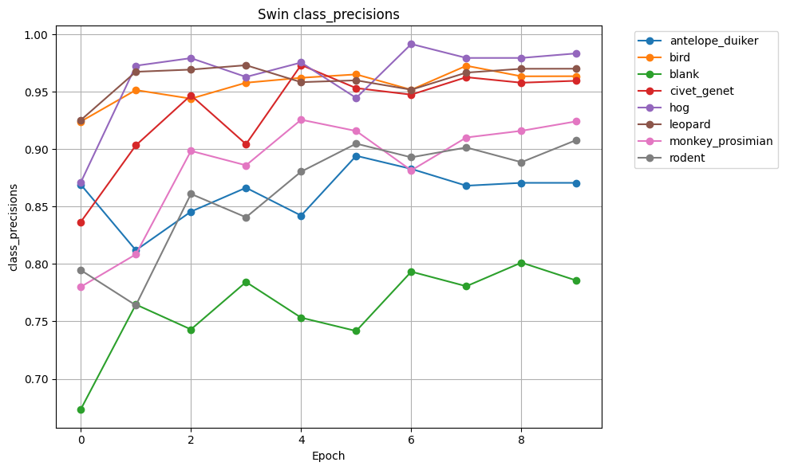
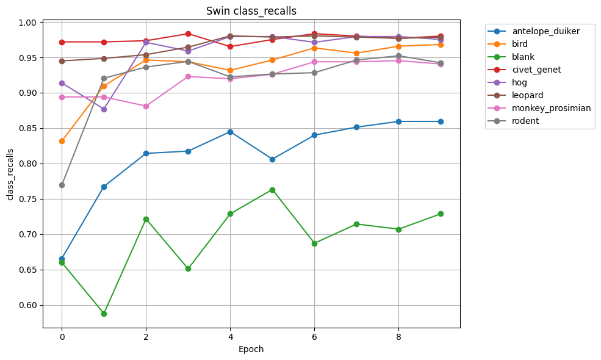

## Swin Transformer (swin_t) Model - Stage 1 Training ✅ COMPLETED

### Model Configuration

**Model Name**: final_swin_t_model_part1_best.pth (best), final_swin_t_model_part1.pth (final)

**Architecture**: Swin Transformer Tiny (swin_t) with IMAGENET1K_V1 pretrained weights

**Number of Classes**: 8 (antelope_duiker, bird, blank, civet_genet, hog, leopard, monkey_prosimian, rodent)

**Model Parameters**: ~28M parameters (3x larger than ResNet18)

### Training Hyperparameters

- **Epochs**: 30 (completed)
- **Batch Size**: 64
- **Learning Rate**: 1e-5 (0.00001)
- **Weight Decay**: 1e-8 (0.00000001)
- **Image Size**: 224x224
- **Stochastic Depth**: 0.2
- **CUDA**: True
- **Criterion**: nn.CrossEntropyLoss()
- **Optimizer**: optim.AdamW(model.parameters(), lr=1e-5, weight_decay=1e-8)
- **Learning Rate Scheduler**: None
- **Mixup**: Disabled
- **Mixed Precision Training**: Enabled (autocast + GradScaler)
- **Train/Val Split**: 75% train / 25% validation
- **DataLoader Workers**: 4

### Data Augmentation

**Train Transforms**:

```python
train_transform = transforms.Compose(
    [
        transforms.Resize((224, 224)),
        transforms.ToTensor(),
        transforms.Normalize(mean=[0.485, 0.456, 0.406], std=[0.229, 0.224, 0.225]),
    ]
)
```

**Validation Transforms**:

```python
val_transform = transforms.Compose(
    [
        transforms.Resize((224, 224)),
        transforms.ToTensor(),
        transforms.Normalize(mean=[0.485, 0.456, 0.406], std=[0.229, 0.224, 0.225]),
    ]
)
```

### Model Architecture Details

- **Base Model**: Swin Transformer Tiny from torchvision.models
- **Pretrained Weights**: IMAGENET1K_V1 (ImageNet pretrained)
- **Architecture Type**: Vision Transformer with shifted windows
- **Final Layer**: Modified head (Linear: 768 → 8 classes)
- **Input Shape**: (3, 224, 224)
- **Model Head**: `Linear(in_features=768, out_features=8, bias=True)`
- **Stochastic Depth**: Applied to all transformer blocks (p=0.2)

### Training Details

- **Training Instance**: ml.g4dn.xlarge (Tesla T4, 8 vCPUs, 32 GB RAM)
- **GPU Memory**: 16 GB GDDR6
- **Device**: CUDA (Tesla T4)
- **Data Loading**: AnimalDataset (custom PyTorch Dataset)
- **DataLoader Workers**: 4 (optimized for CPU cores)
- **Best Model Selection**: Based on validation accuracy
- **Model Saving**:
  - Best model: final_swin_t_model_part1_best.pth (saved when val_acc improves)
  - Final model: final_swin_t_model_part1.pth (saved at end of training)
- **Output Path**: s3://sagemaker-us-west-1-253490779227/animal-classification-models_part1
- **Data Source**: S3 bucket (processed data)

### Memory Management & Optimization

- **Mixed Precision Training**: Enabled with `torch.cuda.amp` (autocast + GradScaler)
  - Reduces memory usage by ~40%
  - Speeds up training by ~2-3x on Tensor Cores
- **GPU Memory Tracking**: Enabled at all key checkpoints
- **Memory Cleanup**: `torch.cuda.empty_cache()` before each epoch
- **Garbage Collection**: Enabled (`gc` module)
- **Memory Prints**:
  - Initial state
  - After loading CSV
  - After creating datasets
  - Before/after moving model to GPU
  - Start/end of each epoch

### Results ✅

**Final Epoch Metrics** (Epoch 9/10):

Epoch 9: train_acc=0.9908 train_loss=0.0304 val_acc=0.9161 val_loss=0.4141

**Best Validation Accuracy**: **91.61% (0.9161)**

Train
| Epoch |    Acc |   Loss | LogLoss | Top-3 Acc |
| ----: | -----: | -----: | ------: | --------: |
|     0 | 0.6862 | 0.8917 |  0.8917 |    0.9097 |
|     1 | 0.8469 | 0.4627 |  0.4627 |    0.9735 |
|     2 | 0.8950 | 0.3136 |  0.3136 |    0.9884 |
|     3 | 0.9296 | 0.2152 |  0.2152 |    0.9948 |
|     4 | 0.9524 | 0.1531 |  0.1531 |    0.9966 |
|     5 | 0.9638 | 0.1134 |  0.1134 |    0.9981 |
|     6 | 0.9760 | 0.0740 |  0.0740 |    0.9992 |
|     7 | 0.9846 | 0.0495 |  0.0495 |    0.9997 |
|     8 | 0.9870 | 0.0375 |  0.0375 |    0.9998 |
|     9 | 0.9908 | 0.0304 |  0.0304 |    0.9998 |

Val
| Epoch |    Acc |   Loss | LogLoss | Top-3 Acc |
| ----: | -----: | -----: | ------: | --------: |
|     0 | 0.8265 | 0.5436 |  0.5436 |    0.9097 |
|     1 | 0.8566 | 0.4361 |  0.4361 |    0.9735 |
|     2 | 0.8918 | 0.3720 |  0.3720 |    0.9884 |
|     3 | 0.8920 | 0.3713 |  0.3713 |    0.9948 |
|     4 | 0.9030 | 0.3526 |  0.3526 |    0.9966 |
|     5 | 0.9059 | 0.3797 |  0.3797 |    0.9981 |
|     6 | 0.9064 | 0.3935 |  0.3935 |    0.9992 |
|     7 | 0.9129 | 0.4007 |  0.4007 |    0.9997 |
|     8 | 0.9144 | 0.4136 |  0.4136 |    0.9998 |
|     9 | 0.9161 | 0.4141 |  0.4141 |    0.9998 |

Class Precision
| Class                | Epoch 0 | Epoch 1 | Epoch 2 | Epoch 3 | Epoch 4 | Epoch 5 | Epoch 6 | Epoch 7 | Epoch 8 | Epoch 9 |
| -------------------- | ------: | ------: | ------: | ------: | ------: | ------: | ------: | ------: | ------: | ------: |
| **antelope_duiker**  |  0.8692 |  0.8120 |  0.8456 |  0.8664 |  0.8422 |  0.8943 |  0.8829 |  0.8682 |  0.8707 |  0.8707 |
| **bird**             |  0.9241 |  0.9515 |  0.9440 |  0.9579 |  0.9622 |  0.9652 |  0.9518 |  0.9727 |  0.9635 |  0.9636 |
| **blank**            |  0.6734 |  0.7647 |  0.7430 |  0.7843 |  0.7533 |  0.7417 |  0.7933 |  0.7806 |  0.8012 |  0.7856 |
| **civet_genet**      |  0.8366 |  0.9034 |  0.9470 |  0.9044 |  0.9734 |  0.9532 |  0.9475 |  0.9627 |  0.9579 |  0.9596 |
| **hog**              |  0.8711 |  0.9727 |  0.9793 |  0.9630 |  0.9755 |  0.9447 |  0.9916 |  0.9795 |  0.9795 |  0.9835 |
| **leopard**          |  0.9253 |  0.9675 |  0.9694 |  0.9732 |  0.9584 |  0.9600 |  0.9518 |  0.9667 |  0.9701 |  0.9701 |
| **monkey_prosimian** |  0.7801 |  0.8084 |  0.8985 |  0.8860 |  0.9257 |  0.9159 |  0.8816 |  0.9102 |  0.9160 |  0.9243 |
| **rodent**           |  0.7947 |  0.7640 |  0.8611 |  0.8407 |  0.8805 |  0.9049 |  0.8929 |  0.9015 |  0.8887 |  0.9080 |



Class Recalls
| Class                | Epoch 0 | Epoch 1 | Epoch 2 | Epoch 3 | Epoch 4 | Epoch 5 | Epoch 6 | Epoch 7 | Epoch 8 | Epoch 9 |
| -------------------- | ------: | ------: | ------: | ------: | ------: | ------: | ------: | ------: | ------: | ------: |
| **antelope_duiker**  |  0.6656 |  0.7674 |  0.8142 |  0.8174 |  0.8449 |  0.8061 |  0.8401 |  0.8514 |  0.8595 |  0.8595 |
| **bird**             |  0.8317 |  0.9098 |  0.9463 |  0.9439 |  0.9317 |  0.9463 |  0.9634 |  0.9561 |  0.9659 |  0.9683 |
| **blank**            |  0.6600 |  0.5877 |  0.7215 |  0.6510 |  0.7288 |  0.7631 |  0.6872 |  0.7143 |  0.7071 |  0.7288 |
| **civet_genet**      |  0.9719 |  0.9719 |  0.9736 |  0.9835 |  0.9653 |  0.9752 |  0.9835 |  0.9802 |  0.9769 |  0.9802 |
| **hog**              |  0.9139 |  0.8770 |  0.9713 |  0.9590 |  0.9795 |  0.9795 |  0.9713 |  0.9795 |  0.9795 |  0.9754 |
| **leopard**          |  0.9450 |  0.9486 |  0.9539 |  0.9645 |  0.9805 |  0.9787 |  0.9805 |  0.9787 |  0.9770 |  0.9787 |
| **monkey_prosimian** |  0.8941 |  0.8941 |  0.8812 |  0.9230 |  0.9197 |  0.9262 |  0.9438 |  0.9438 |  0.9454 |  0.9406 |
| **rodent**           |  0.7694 |  0.9205 |  0.9364 |  0.9443 |  0.9225 |  0.9264 |  0.9284 |  0.9463 |  0.9523 |  0.9423 |



Class F1
| Class                | Epoch 0 | Epoch 1 | Epoch 2 | Epoch 3 | Epoch 4 | Epoch 5 | Epoch 6 | Epoch 7 | Epoch 8 | Epoch 9 |
| -------------------- | ------: | ------: | ------: | ------: | ------: | ------: | ------: | ------: | ------: | ------: |
| **antelope_duiker**  |  0.7539 |  0.7890 |  0.8296 |  0.8412 |  0.8435 |  0.8479 |  0.8609 |  0.8597 |  0.8650 |  0.8650 |
| **bird**             |  0.8755 |  0.9302 |  0.9452 |  0.9509 |  0.9467 |  0.9557 |  0.9576 |  0.9643 |  0.9647 |  0.9659 |
| **blank**            |  0.6667 |  0.6646 |  0.7321 |  0.7115 |  0.7408 |  0.7522 |  0.7364 |  0.7460 |  0.7512 |  0.7561 |
| **civet_genet**      |  0.8992 |  0.9364 |  0.9601 |  0.9423 |  0.9693 |  0.9641 |  0.9652 |  0.9714 |  0.9673 |  0.9698 |
| **hog**              |  0.8920 |  0.9224 |  0.9753 |  0.9610 |  0.9775 |  0.9618 |  0.9814 |  0.9795 |  0.9795 |  0.9794 |
| **leopard**          |  0.9351 |  0.9579 |  0.9616 |  0.9688 |  0.9693 |  0.9693 |  0.9659 |  0.9727 |  0.9735 |  0.9744 |
| **monkey_prosimian** |  0.8332 |  0.8491 |  0.8898 |  0.9041 |  0.9227 |  0.9210 |  0.9116 |  0.9267 |  0.9305 |  0.9324 |
| **rodent**           |  0.7818 |  0.8350 |  0.8971 |  0.8895 |  0.9010 |  0.9155 |  0.9103 |  0.9234 |  0.9194 |  0.9249 |


**Training Summary**:

- **Training Accuracy**: 99.08%
- **Validation Accuracy**: 91.61%
- **Training Loss**: 0.0304
- **Validation Loss**: 0.4141
- **Generalization Gap**: 7.47% (train_acc - val_acc)