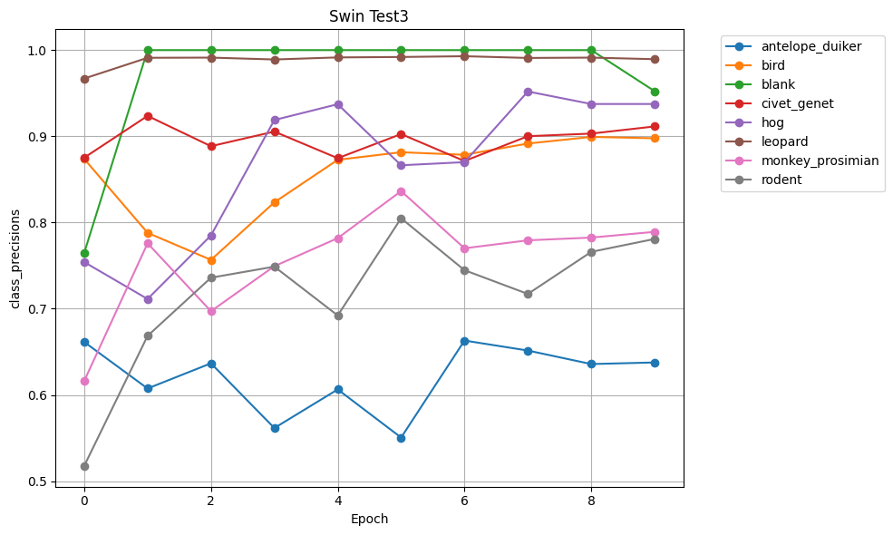
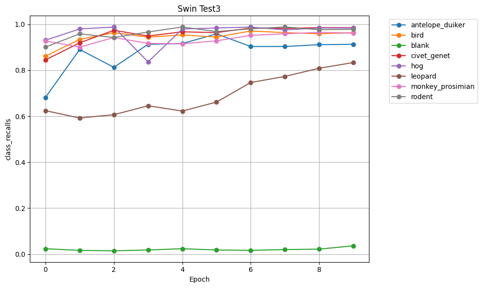
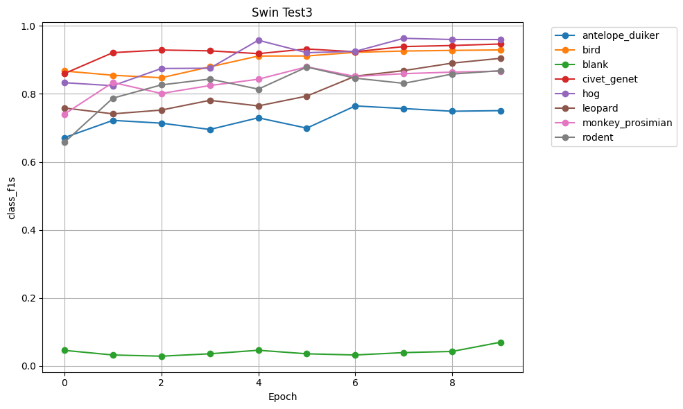

# DSS Animal Classification - ML Pipeline Architecture

## Swin Test 3 Model

### Model Configuration

**Model Name**: final_swin-b_model.pth

**Architecture**: swin_b with IMAGENET1K_V1 pretrained weights

**Number of Classes**: 8 (antelope_duiker, bird, blank, civet_genet, hog, leopard, monkey_prosimian, rodent)

### Training Hyperparameters

- **Epochs**: 5
- **Batch Size**: 16
- **Learning Rate**: 0.001
- **Weight Decay**: 0.01
- **Image Size**: 224x224
- **CUDA**: True
- **Criterion**: nn.CrossEntropyLoss()
- **Optimizer**: optim.AdamW(model.parameters(), lr=args.learning_rate)
- **Learning Rate Scheduler**: CosineAnnealingLR(optimizer, T_max=args.epochs)
- **Mixup**: Disabled
- **Train/Val Split**: 75% train / 25% validation

### Data Augmentation

**Train Transforms Base**:

```python
train_transform = transforms.Compose(
    [
        transforms.Resize((img_size, img_size)),
        transforms.ToTensor(),
        transforms.Normalize(mean=[0.485, 0.456, 0.406], std=[0.229, 0.224, 0.225]),
    ]
)
```

**Validation Transforms**:

```python
val_transform = transforms.Compose(
    [
        transforms.Resize((img_size, img_size)),
        transforms.ToTensor(),
        transforms.Normalize(mean=[0.485, 0.456, 0.406], std=[0.229, 0.224, 0.225]),
    ]
)
```

**Class-Specific Transforms (AnimalDatasetSwin fallback)**:

- **antelope_duiker**: Resize → RandomHorizontalFlip(0.5) → Normalize
- **bird**: Resize → RandomHorizontalFlip(0.5) → Normalize
- **blank**: RandomRotation → Resize → RandomHorizontalFlip(0.4) → ColorJitter → Normalize
- **civet_genet**: Resize → RandomHorizontalFlip(0.5) → Normalize
- **hog**: Resize → RandomHorizontalFlip(0.5) → Normalize
- **leopard**: RandomRotation → Resize → RandomHorizontalFlip(0.4) → ColorJitter → Normalize
- **monkey_prosimian**: Resize → RandomHorizontalFlip(0.5) → Normalize
- **rodent**: Resize → RandomHorizontalFlip(0.5) → Normalize

### Model Architecture Details

- **Base Model**: Swin-B from torchvision.models
- **Pretrained Weights**: IMAGENET1K_V1
- **Final Layer**: Modified head layer (num_features → 8 classes)
- **Input Shape**: (3, 224, 224)

### Training Details

- **Device**: CUDA (if available)
- **Data Loading**: AnimalDatasetSwin (custom PyTorch Dataset)
- **Best Model Selection**: Based on validation accuracy
- **Model Saving**:
  - Final model: final_swin-b_model.pth
  - Best model: final_swin-b_model_{epoch}_best.pth

### Results

**Final Epoch Metrics**:
Epoch 9: train_acc=0.9926 train_loss=0.0277 val_acc=0.8195 val_loss=1.0614

**Best Validation Accuracy**: 0.8195

Train
| Epoch |    Acc |   Loss | LogLoss | Top-3 Acc |
| ----: | -----: | -----: | ------: | --------: |
|     0 | 0.7436 | 0.6786 |  0.6786 |    0.9593 |
|     1 | 0.8919 | 0.3217 |  0.3217 |    0.9922 |
|     2 | 0.9301 | 0.2057 |  0.2057 |    0.9964 |
|     3 | 0.9541 | 0.1396 |  0.1396 |    0.9987 |
|     4 | 0.9686 | 0.0959 |  0.0959 |    0.9991 |
|     5 | 0.9780 | 0.0687 |  0.0687 |    0.9995 |
|     6 | 0.9837 | 0.0525 |  0.0525 |    0.9997 |
|     7 | 0.9890 | 0.0369 |  0.0369 |    0.9998 |
|     8 | 0.9914 | 0.0293 |  0.0293 |    0.9998 |
|     9 | 0.9926 | 0.0277 |  0.0277 |    0.9999 |

Val
| Epoch |    Acc |   Loss | LogLoss | Top-3 Acc |
| ----: | -----: | -----: | ------: | --------: |
|     0 | 0.7060 | 1.3601 |  1.3601 |    0.9593 |
|     1 | 0.7559 | 1.2916 |  1.2916 |    0.9922 |
|     2 | 0.7618 | 1.3606 |  1.3606 |    0.9964 |
|     3 | 0.7671 | 1.5260 |  1.5260 |    0.9987 |
|     4 | 0.7797 | 1.2058 |  1.2058 |    0.9991 |
|     5 | 0.7889 | 1.4065 |  1.4065 |    0.9995 |
|     6 | 0.8030 | 1.3024 |  1.3024 |    0.9997 |
|     7 | 0.8074 | 1.2231 |  1.2231 |    0.9998 |
|     8 | 0.8137 | 1.1787 |  1.1787 |    0.9998 |
|     9 | 0.8195 | 1.0614 |  1.0614 |    0.9999 |


Class Percision for Swin Test 3

| Class                | Epoch 0 | Epoch 1 | Epoch 2 | Epoch 3 | Epoch 4 | Epoch 5 | Epoch 6 | Epoch 7 | Epoch 8 | Epoch 9 |
| -------------------- | ------: | ------: | ------: | ------: | ------: | ------: | ------: | ------: | ------: | ------: |
| **antelope_duiker**  |  0.6614 |  0.6075 |  0.6367 |  0.5616 |  0.6064 |  0.5506 |  0.6631 |  0.6515 |  0.6359 |  0.6377 |
| **bird**             |  0.8738 |  0.7881 |  0.7567 |  0.8234 |  0.8728 |  0.8815 |  0.8786 |  0.8916 |  0.8993 |  0.8977 |
| **blank**            |  0.7647 |  1.0000 |  1.0000 |  1.0000 |  1.0000 |  1.0000 |  1.0000 |  1.0000 |  1.0000 |  0.9524 |
| **civet_genet**      |  0.8752 |  0.9237 |  0.8886 |  0.9055 |  0.8746 |  0.9026 |  0.8713 |  0.9002 |  0.9032 |  0.9115 |
| **hog**              |  0.7542 |  0.7113 |  0.7850 |  0.9189 |  0.9373 |  0.8664 |  0.8700 |  0.9520 |  0.9375 |  0.9375 |
| **leopard**          |  0.9670 |  0.9911 |  0.9913 |  0.9891 |  0.9915 |  0.9920 |  0.9929 |  0.9909 |  0.9913 |  0.9895 |
| **monkey_prosimian** |  0.6162 |  0.7759 |  0.6971 |  0.7493 |  0.7819 |  0.8365 |  0.7701 |  0.7794 |  0.7826 |  0.7892 |
| **rodent**           |  0.5177 |  0.6685 |  0.7360 |  0.7488 |  0.6922 |  0.8050 |  0.7447 |  0.7172 |  0.7660 |  0.7810 |



Clas Recalls

| Class                | Epoch 0 | Epoch 1 | Epoch 2 | Epoch 3 | Epoch 4 | Epoch 5 | Epoch 6 | Epoch 7 | Epoch 8 | Epoch 9 |
| -------------------- | ------: | ------: | ------: | ------: | ------: | ------: | ------: | ------: | ------: | ------: |
| **antelope_duiker**  |  0.6817 |  0.8901 |  0.8126 |  0.9128 |  0.9160 |  0.9580 |  0.9031 |  0.9031 |  0.9111 |  0.9128 |
| **bird**             |  0.8610 |  0.9341 |  0.9634 |  0.9439 |  0.9537 |  0.9439 |  0.9707 |  0.9634 |  0.9585 |  0.9634 |
| **blank**            |  0.0235 |  0.0163 |  0.0145 |  0.0181 |  0.0235 |  0.0181 |  0.0163 |  0.0199 |  0.0217 |  0.0362 |
| **civet_genet**      |  0.8449 |  0.9191 |  0.9736 |  0.9488 |  0.9670 |  0.9637 |  0.9835 |  0.9818 |  0.9851 |  0.9851 |
| **hog**              |  0.9303 |  0.9795 |  0.9877 |  0.8361 |  0.9795 |  0.9836 |  0.9877 |  0.9754 |  0.9836 |  0.9836 |
| **leopard**          |  0.6241 |  0.5922 |  0.6064 |  0.6454 |  0.6223 |  0.6613 |  0.7465 |  0.7730 |  0.8085 |  0.8333 |
| **monkey_prosimian** |  0.9278 |  0.9005 |  0.9422 |  0.9165 |  0.9149 |  0.9278 |  0.9518 |  0.9583 |  0.9647 |  0.9615 |
| **rodent**           |  0.9006 |  0.9583 |  0.9423 |  0.9662 |  0.9881 |  0.9682 |  0.9801 |  0.9881 |  0.9761 |  0.9781 |


class F1

| Class                | Epoch 0 | Epoch 1 | Epoch 2 | Epoch 3 | Epoch 4 | Epoch 5 | Epoch 6 | Epoch 7 | Epoch 8 | Epoch 9 |
| -------------------- | ------: | ------: | ------: | ------: | ------: | ------: | ------: | ------: | ------: | ------: |
| **antelope_duiker**  |  0.6714 |  0.7221 |  0.7140 |  0.6954 |  0.7297 |  0.6993 |  0.7647 |  0.7569 |  0.7490 |  0.7508 |
| **bird**             |  0.8673 |  0.8549 |  0.8476 |  0.8795 |  0.9114 |  0.9117 |  0.9224 |  0.9261 |  0.9280 |  0.9294 |
| **blank**            |  0.0456 |  0.0320 |  0.0285 |  0.0355 |  0.0459 |  0.0355 |  0.0320 |  0.0390 |  0.0425 |  0.0697 |
| **civet_genet**      |  0.8598 |  0.9214 |  0.9291 |  0.9267 |  0.9185 |  0.9322 |  0.9240 |  0.9392 |  0.9424 |  0.9469 |
| **hog**              |  0.8330 |  0.8241 |  0.8748 |  0.8755 |  0.9579 |  0.9213 |  0.9251 |  0.9636 |  0.9600 |  0.9600 |
| **leopard**          |  0.7586 |  0.7414 |  0.7525 |  0.7811 |  0.7647 |  0.7936 |  0.8522 |  0.8685 |  0.8906 |  0.9047 |
| **monkey_prosimian** |  0.7406 |  0.8336 |  0.8014 |  0.8245 |  0.8432 |  0.8798 |  0.8514 |  0.8596 |  0.8641 |  0.8669 |
| **rodent**           |  0.6575 |  0.7876 |  0.8265 |  0.8438 |  0.8141 |  0.8791 |  0.8464 |  0.8311 |  0.8584 |  0.8685 |



### Notes

- Swin-B model fine-tuned with ImageNet normalization
- Cosine annealing learning rate schedule used
- Model saved after all epochs complete
